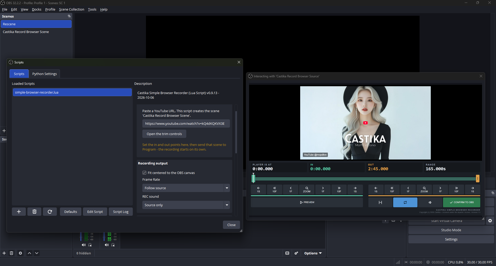
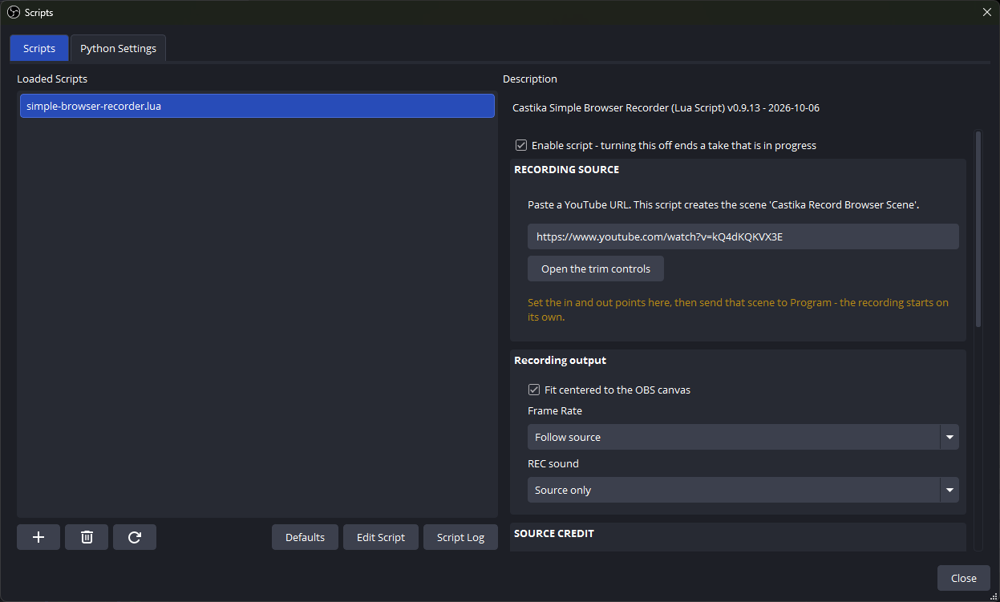
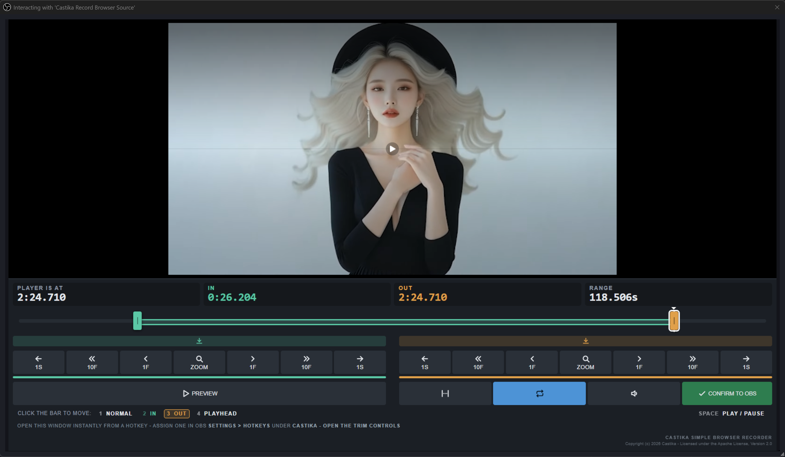

# Castika Simple Browser Source Recorder

An OBS script for news and commentary creators who need to quote video.

Paste a URL, mark the exact in and out points while watching, and send the scene to Program. The script records that range from OBS itself, at the source's own size, without the player's controls or chrome in the picture, and with the source channel credited on screen. No download step, no second editor, no external tools.

## Requirements

OBS Studio on Windows. Nothing else to install. Windows only.

## Install

OBS -> Tools -> Scripts -> **+** -> choose `simple-browser-recorder.lua`.

The script creates the scene `Castika Record Browser Scene` the first time it loads.

## Use

1. Paste a YouTube URL into the script panel.
2. Press **Open the trim controls**, set the in and out points, press **CONFIRM TO OBS**.
3. Send `Castika Record Browser Scene` to Program. Recording starts on its own and stops at the out-point.

While a take is running a `REC` banner sits in the top left of Program. It is a status display only and is never part of the file.

## Settings

| | |
|---|---|
| **Fit centered to the OBS canvas** | On: the file is your canvas size with the video centered inside it. Off: the file is the video's own size. Nothing is ever cropped. |
| **Frame Rate** | The frame rate of the file. `Follow source` uses OBS's own setting. |
| **REC sound** | `Source only` mutes every other audio source for the length of a take, so a mic or a desktop notification cannot land in the clip, and unmutes them when it ends. `Follow OBS audio mixer setting` records the mix as it stands. |
| **Source credit** | Puts the source in the picture, so a quote carries its attribution wherever it ends up. Choose `YouTube @handle`, `YouTube channel name`, the handle or channel name alone, or your own text. Font, colors, corner, and height are yours to set, and what you see in the preview is what lands in the file. |
| **Max recording time** | A cap that stops a runaway take. |

Encoder, container, and output folder come from your OBS recording settings.

## Known Limitations

This script works within YouTube's front-end constraints. The player draws two things over the video that no script can strip:

### Player Control Overlay (at playback start)

YouTube draws its own center playback controls over the first few seconds.

- **Workaround:** Set your in-point a few seconds into the video. The script buffers and plays up to that mark behind a black mask, so the overlay fades out before capture begins. Starting at `00:00` captures the overlay.

### End Screens & Outro Cards

In the closing seconds the player draws channel subscribe buttons and recommended cards over the video.

- **Workaround:** Set your out-point before the end screen appears.

## License

Apache License 2.0. See [LICENSE](LICENSE) and [NOTICE](NOTICE).
